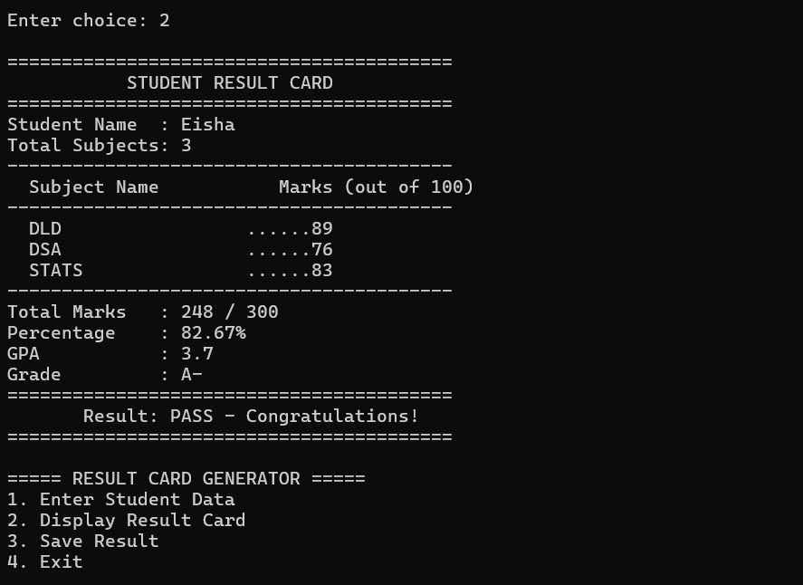

# Result Card Generator in C++

A console-based Result Card Generator built in C++ as part of my Data Structures coursework. The program allows users to enter multiple subjects, calculates academic performance metrics, and generates a formatted result card.

## Features
- Enter a user-defined number of subjects
- Dynamically allocate memory for subjects and marks
- Automatically calculate:
  - Total marks
  - Percentage
  - GPA
  - Final grade
- Display a formatted result card
- Save the result card to a text file
- Menu-driven console interface

## Grading System

| Percentage | Grade | GPA |
|------------|-------|-----|
| 90% and above | A+ | 4.0 |
| 85–89% | A | 4.0 |
| 80–84% | A- | 3.7 |
| 75–79% | B+ | 3.3 |
| 50–74% | Pass | Varies |
| Below 50% | F | 0.0 |

## Concepts Used
- C++ Structures (`struct`)
- Arrays and loops
- Dynamic memory allocation
- Conditional statements
- Functions
- File handling (`fstream`)
- Console formatting (`iomanip`)
- Menu-driven programming

## What I Learned
- Organizing data using structures
- Processing user input dynamically
- Implementing grading and GPA calculations
- Reading from and writing to files
- Designing user-friendly console applications

## How to Run
1. Clone this repository or download the source code.
2. Open the project in Code::Blocks or any C++ compiler.
3. Compile and run the program.

## Technologies Used
- C++
- Object-Oriented Programming concepts
- File Handling
- Standard Template Libraries (if used)

## Sample Output

